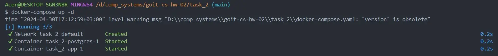
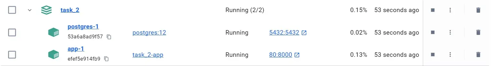

# Computer Systems hw-02

This repository contains the solutions to two tasks:

[Task 1: Website Availability Checker](task_1)
[Task 2: FastAPI Application in Docker Container](task_2)

## Task 1: Website Availability Checker

### Description

The script in the automatically checks the availability of specific websites using the `curl` command. It verifies whether each website responds with an HTTP status code of `200`, indicating successful availability.

### Execution and Results

**Script Execution:** Run the script `website_test.sh` in the `task_1` folder.

```bash
$ bash website_test.sh
Results written to website_status.log
```

**Log File:** The script logs the availability status of each website in the file `website_status.log`.

```log
https://google.com is UP
https://facebook.com is UP
https://twitter.com is UP
```

## Task 2: FastAPI Application in Docker Container

### Description

The `task_2` folder contains a FastAPI application configured to run within a Docker container. The task involved setting up the Docker environment, including `Dockerfile` and `docker-compose.yaml`, and verifying the application's functionality and database connection.

### Execution and Results

**Docker Setup:** Navigate to the `task_2` folder and run `docker-compose up` to start the Docker container.




**Accessing the Application:** Once the container is running, access the FastAPI application in the browser.
**Verification:** Ensure that the application loads successfully and the database connection is established.
**Example Results:** Clicking the "Check DB" button in the browser displays "Welcome to FastAPI!".


